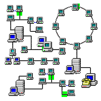

## Home Monitoring
> Project on IoT - Internet of Things

Auxiliary project developed for the research project "Development of Prototypes of Internet of Things Solutions for monitoring in domestic environments" carried out at IFPB - Campus Campina Grande

### Idea

The project idea is to implement a wireless sensor network using two main components: Raspberry Pi 3B and ESP32.

### Operation

ESP32 plays the role of a client in a home, in which sensors and actuators can be added, which will work by sending or receiving data to ESP32 and later ESP32 sends this data to the broker, which functions as a controller.

In the Broker it is possible to perform data filtering, sending data to the Cloud, activating other devices and many other possibilities.

> The sensor used in the project was the ultrasonic - HC-SR04.
> The actuator used was the Micro Servo 9g SG90.

### Libraries and resources

In ESP32 the libraries [PubSubClient.h](https://pubsubclient.knolleary.net/) and [WiFi.h](https://www.arduino.cc/en/Reference/WiFi) were used.

The libraries [Eclipse Paho MQTT](https://www.eclipse.org/paho/clients/js/) and [firebase.js](https://firebase.google.com/docs/web/setup?hl=en).

### Sending and Receiving Data

For sending and receiving data we use the MQTT protocol. In ESP32 PubSubClient is responsible for MQTT, while on the WEB interface, we use Eclipse Paho MQTT for JavaScript.

> You can use this interface on another device and access the broker.

### Future works

Use other sensors and actuators for testing and possible application in the future.
Test network behavior with other technologies.

###### Credits: Gif from [pinterest.com](https://pinterest.com/)

> Português

## Home Monitoring
> Projeto sobre IoT - Internet das Coisas

Projeto auxiliar desenvolvido para o projeto de pesquisa "Desenvolvimento de Protótipos de Soluções de Internet das Coisas para monitoramento em ambientes domésticos" realizado no IFPB - Campus Campina Grande

### Ideia

A ideia do projeto é a implementação de um rede de sensores sem fio com a utilização de dois componentes principais: Raspberry Pi 3B e ESP32. 

### Funcionamento

O ESP32 faz o papel de cliente em uma residência, nele podem ser adicionados tanto sensores como atuadores que funcionarão enviando ou recebendo dados para o ESP32 e posteriormente o ESP32 envia esses dados para o broker, que funciona como controlador.

No Broker é possível realizar filtragem de dados, envio de dados para a Nuvem, acionamento de outros dispositivos e muitas outras possibilidades.

> O sensor utilizado no projeto foi o ultrassônico - HC-SR04.
> O atuador utilizado foi o Micro Servo 9g SG90.

### Biblotecas e recursos

No ESP32 foram utilizadas as bibliotecas [PubSubClient.h](https://pubsubclient.knolleary.net/) e a [WiFi.h](https://www.arduino.cc/en/Reference/WiFi). 

Na interface WEB foram utilizadas as bibliotecas [Eclipse Paho MQTT](https://www.eclipse.org/paho/clients/js/) e a [firebase.js](https://firebase.google.com/docs/web/setup?hl=pt-br).

### Envio e Recebimento de dados

Para o envio e recebimento de dados utilizamos o protocolo MQTT. No ESP32 a PubSubClient é responsável pelo MQTT, já na interface WEB, utilizamos o Eclipse Paho MQTT para JavaScript.

> É possível usar essa interface em outro dispositivo e acessar o broker.

### Trabalhos Futuros

Utilizar outros sensores e atuadores para testes e possível aplicação no futuro.
Testar comportamento da rede com outras tecnologias.

###### Créditos: Gif from [pinterest.com](https://pinterest.com/)
